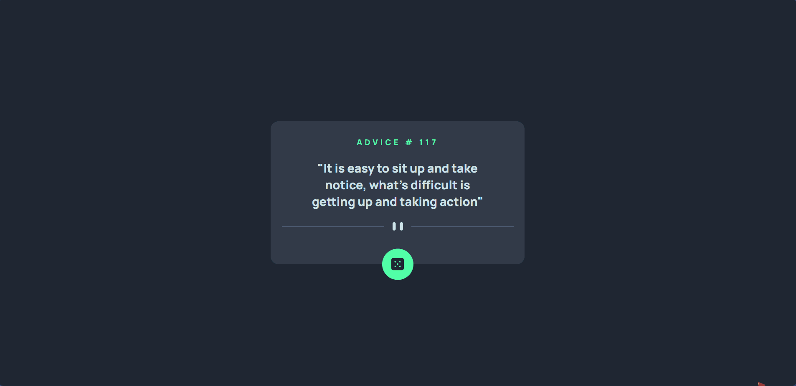
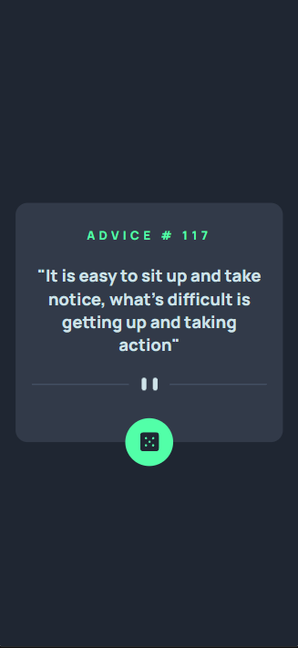

# Frontend Mentor - Advice generator app solution

Esta é uma solução para o [Desafio do aplicativo gerador de conselhos no Frontend Mentor](https://www.frontendmentor.io/challenges/advice-generator-app-QdUG-13db). Os desafios do Frontend Mentor ajudam você a melhorar suas habilidades de codificação criando projetos realistas.

## Índice

- Visão Geral
  - Screenshot
- Meu processo
  - Construído com
- Autor

## Visão Geral

### Screenshot

## Meu processo

### Construído com

- Marcação HTML5 semântica
- Propriedades personalizadas CSS
- Flexbox
- JavaScript

## Author

- Linkedin - [Robson-Jorge](https://www.linkedin.com/in/robson-jorge-62a12a26a/)
- Frontend Mentor - [Robson-Jorge](https://www.frontendmentor.io/profile/Robson-Jorge)
- GitHub - [Robson-Jorge](https://github.com/Robson-Jorge)
